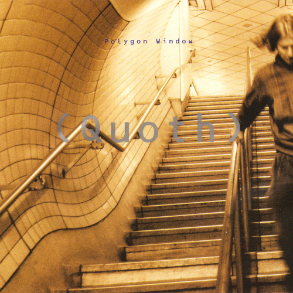
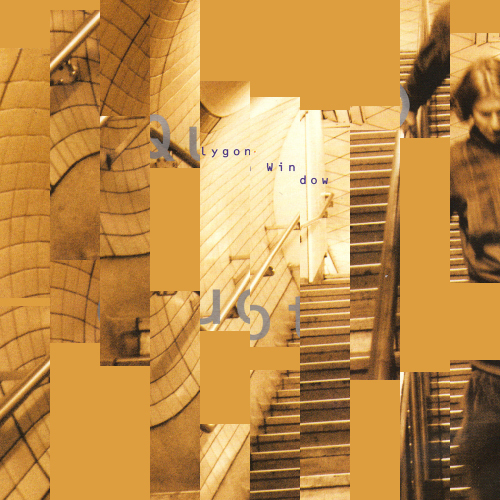
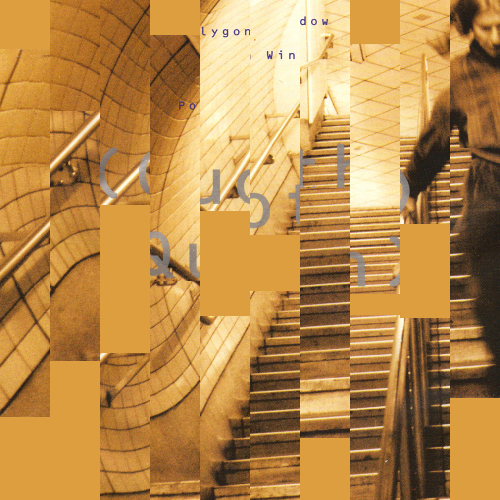

  

#  Polygon Parallax

This experiment takes in the cover art from Polygon Window's *Quoth* album. The image is then sliced up and the slices are scattered at random points above and below the space the stage occupies.

Using GSAP, those slices are then animated onto the stage, pause, and then yoyo back out. Once these animations are complete, the `setResetSlivers()` function again scatters the slices at random positions off stage.

Rinse. Repeat.

  

##  Current Permutations

There are three versions currently.

 1. 5 columns + 1 row
 2. 10 columns + 1 row
 3. 10 columns + 2 rows

The samples below show the 3rd variety.
  
  

##  Samples of Output

  

  

  

  
  
  
  

##  Inspiration

The inspiration for the experiment comes from Mike McQuade's *Consumer Reports - Medical Identity Theft* poster:

  

  

To see more of his work, visit his website, [https://mikemcquade.com/](https://mikemcquade.com/)

  

  

#  🏂🍗